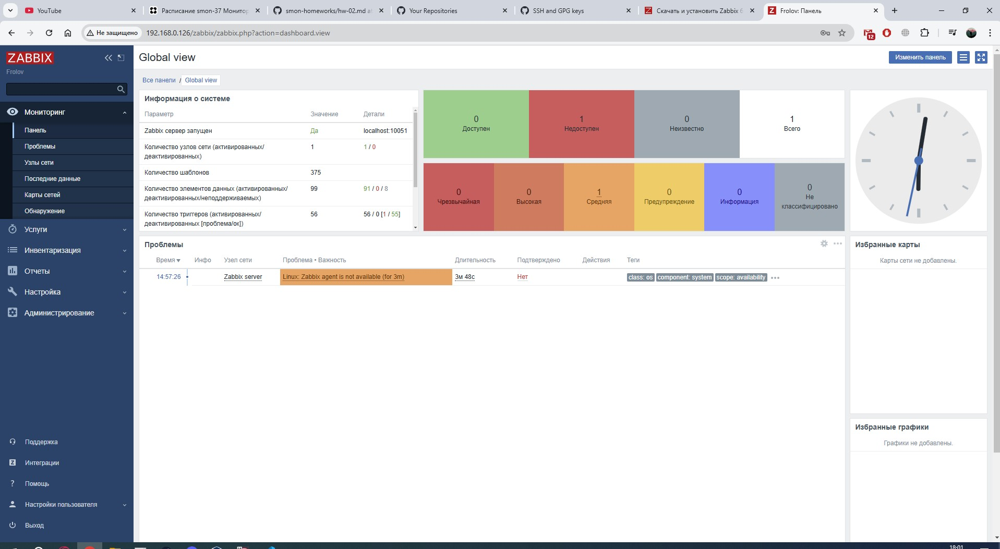
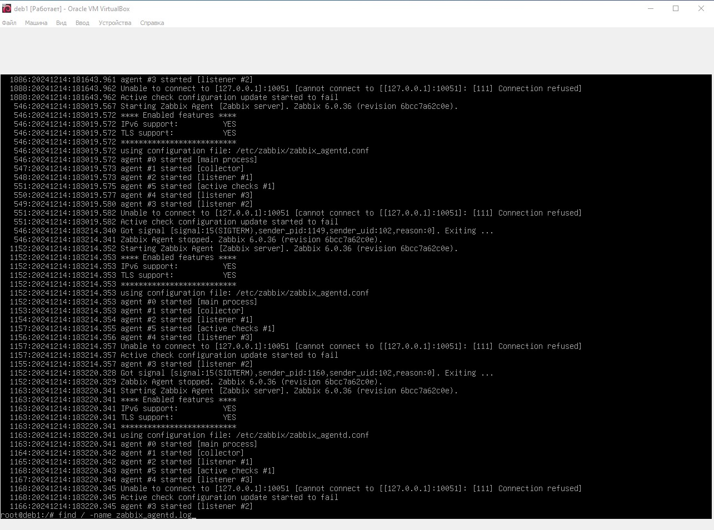
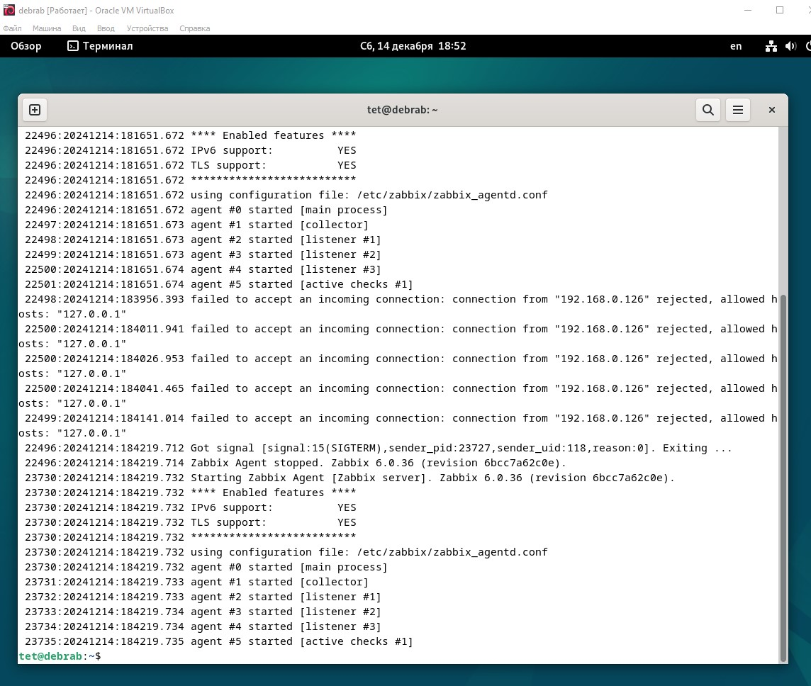
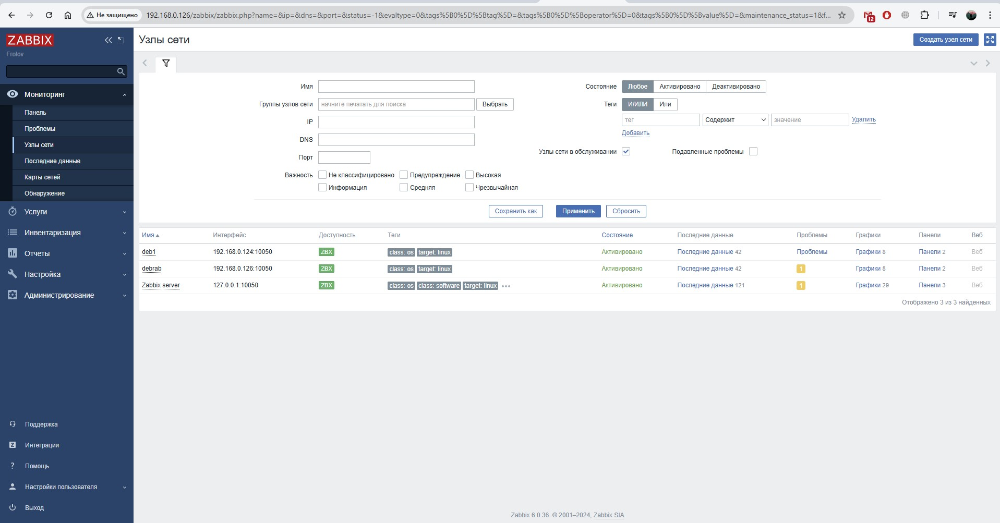
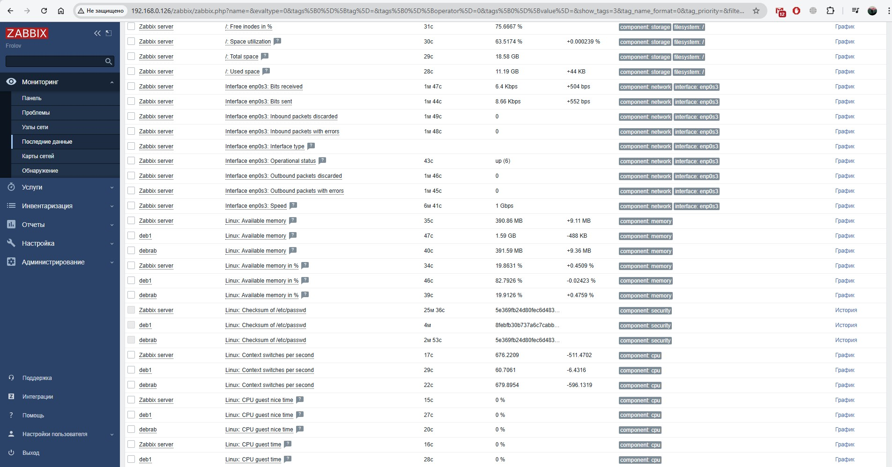

# Домашнее задание к занятию "`Мониторинг`" - `Фролов К.С`

### Задание 1

`Установите Zabbix Server с веб-интерфейсом.`

#### Требования к результатам 
1. Прикрепите в файл README.md скриншот авторизации в админке.
2. Приложите в файл README.md текст использованных команд в GitHub.

#### Ответ:
1. apt install postgresql
2. wget https://repo.zabbix.com/zabbix/6.0/debian/pool/main/z/zabbix-release/zabbix-release_latest_6.0+debian12_all.deb
3. dpkg -i zabbix-release_latest_6.0+debian12_all.deb
4. apt update
5. apt install zabbix-server-pgsql zabbix-frontend-php php8.2-pgsql zabbix-apache-conf zabbix-sql-scripts
6. su - postgres -c 'psql --command "CREATE USER zabbix WITH PASSWORD '\'12345\'';"'
7. su - postgres -c 'psql --command "CREATE DATABASE zabbix OWNER zabbix;"'
8. zcat /usr/share/zabbix-sql-scripts/postgresql/server.sql.gz | sudo -u zabbix psql zabbix
9. nano /etc/zabbix/zabbix_server.conf либо sed -i 's/# DBPassword=/DBPassword=12345/g' /etc/zabbix/zabbix_server.conf
10. systemctl restart zabbix-server apache2
11. systemctl enable zabbix-server apache2

---

### Задание 2

`Установите Zabbix Agent на два хоста.`

#### Требования к результатам 

1. Приложите в файл README.md скриншот раздела Configuration > Hosts, где видно, что агенты подключены к серверу
2. Приложите в файл README.md скриншот лога zabbix agent, где видно, что он работает с сервером
3. Приложите в файл README.md скриншот раздела Monitoring > Latest data для обоих хостов, где видны поступающие от агентов данные.
4. Приложите в файл README.md текст использованных команд в GitHub

#### Ответ: 

1. wget https://repo.zabbix.com/zabbix/6.0/debian/pool/main/z/zabbix-release/zabbix-release_latest_6.0+debian12_all.deb
2. dpkg -i zabbix-release_latest_6.0+debian12_all.deb
3. apt update
4. apt install zabbix-agent
5. nano /etc/zabbix/zabbix_agentd.conf 
6. systemctl restart zabbix-agent
7. systemctl enable zabbix-agent
8. cat /var/log/zabbix/zabbix_agentd.log